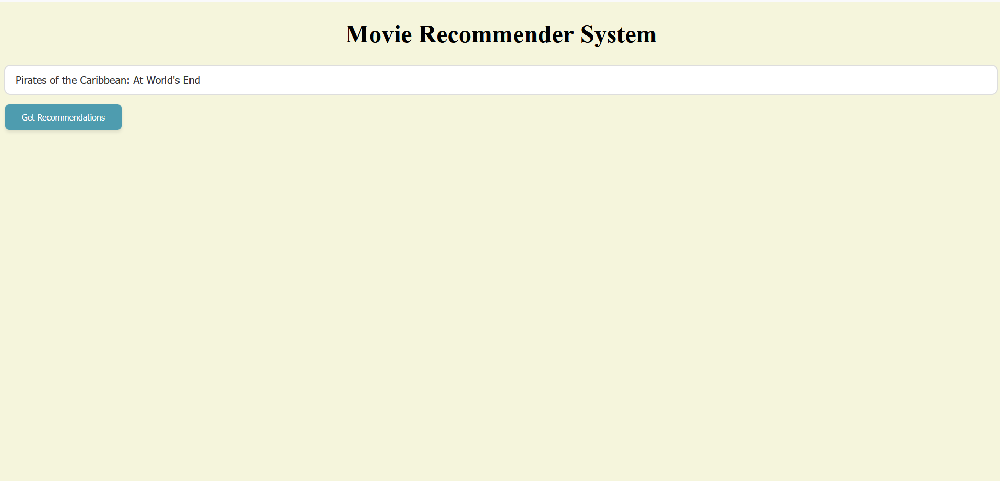
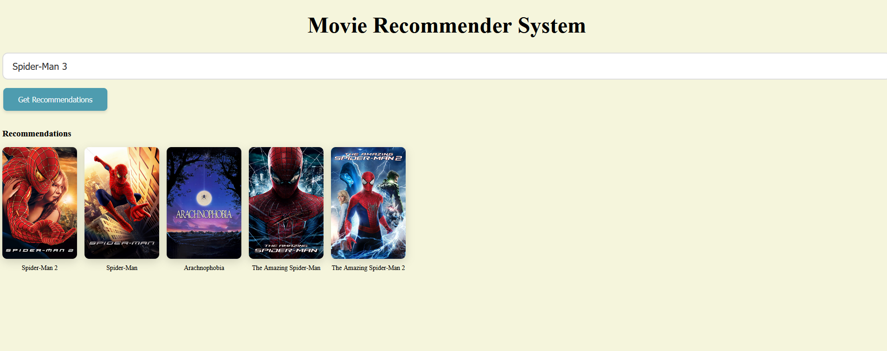
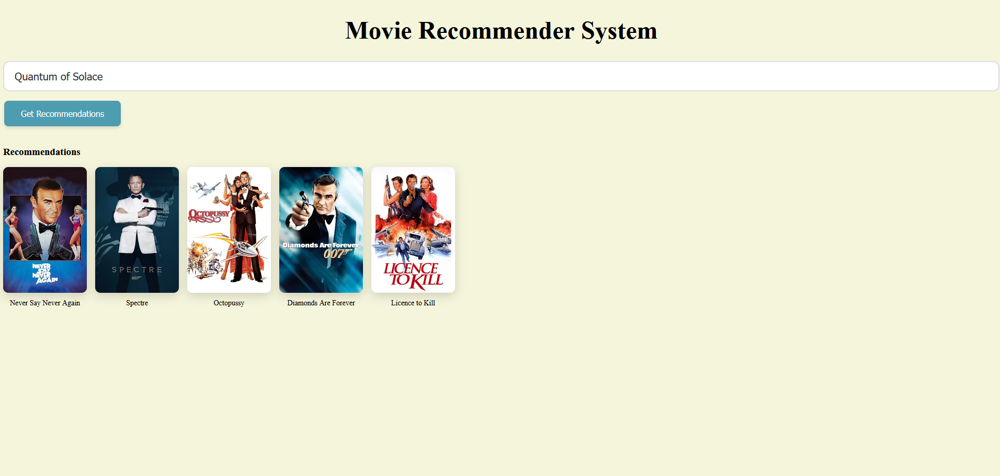

# 🎬 Movie Recommender System

A content-based Movie Recommendation System built using Python, Flask, and machine learning techniques.  
The application recommends similar movies based on user selection and dynamically fetches movie posters using the TMDB API.

---

## 📊 Dataset

This project uses the **TMDB Movie Metadata Dataset**:

https://www.kaggle.com/datasets/tmdb/tmdb-movie-metadata

The CSV dataset files are included inside the `dataset/` directory.

Generated model artifacts (`.pkl` files) are not stored in this repository due to GitHub file size limitations and must be created locally.
pkl files can be genereated by running model_builder.py. They are generated in the dataset folder.

---

## 📸 Demo Screenshots

### Home Page



### Recommendation Results





## 🚀 Features

- Content-based recommendation system
- TF-IDF vectorization of movie metadata
- Cosine similarity computation
- Precomputed similarity matrix
- Dynamic movie poster retrieval using TMDB API
- Interactive Flask web interface

---

## 🛠️ Tech Stack

- Python
- Flask
- Pandas
- NumPy
- Scikit-learn
- HTML / CSS

---

## 🧠 Technical Approach

### 1️⃣ Data Processing

- Merge relevant metadata columns
- Clean and preprocess text fields
- Combine features into a single content feature

### 2️⃣ Feature Engineering

- Apply **TF-IDF Vectorization**
- Convert textual movie descriptions into numerical vectors

### 3️⃣ Similarity Computation

- Compute **Cosine Similarity**
- Generate similarity matrix between all movies
- Store results in `similarity.pkl`

### 4️⃣ Recommendation Logic

When a user selects a movie:

- Locate movie index
- Retrieve similarity scores
- Sort and select top-N similar movies
- Fetch posters via TMDB API
- Return recommendations to frontend

## 📂 Project Structure

Movie-recommender-system/
│
├── dataset/ # TMDB CSV files
├── static/
│ └── css/
├── templates/
│ └── index.html
├── app.py # Flask application
├── model_builder.py # Generates movies.pkl and similarity.pkl
├── movie.ipynb # Development & experimentation notebook
├── requirements.txt
├── .gitignore
└── README.md

---

## ⚙️ Installation

Clone the repository:

```bash
git clone https://github.com/uraza116/Movie-recommender-system.git
cd Movie-recommender-system


python -m venv .venv
Activate:

Windows:
.venv\Scripts\activate

Mac/Linux:
source .venv/bin/activate

Install dependencies:

pip install -r requirements.txt
```

## 📈 Generate Model Files

- Before running the application, generate the required model artifacts:
- python model_builder.py

- This will create: movies.pkl & similarity.pkl

- These files are required for the Flask application to run.

▶️ Run the Application
python app.py

Open in your browser:
http://127.0.0.1:5000

## 🔑 TMDB API Setup

- This project uses The Movie Database (TMDB) API to fetch movie posters.
- Create an account at https://www.themoviedb.org
- Generate an API key
- Replace the API key inside app.py

👨‍💻 Author

Usman Raza
PhD Candidate | Backend & ML Engineer
